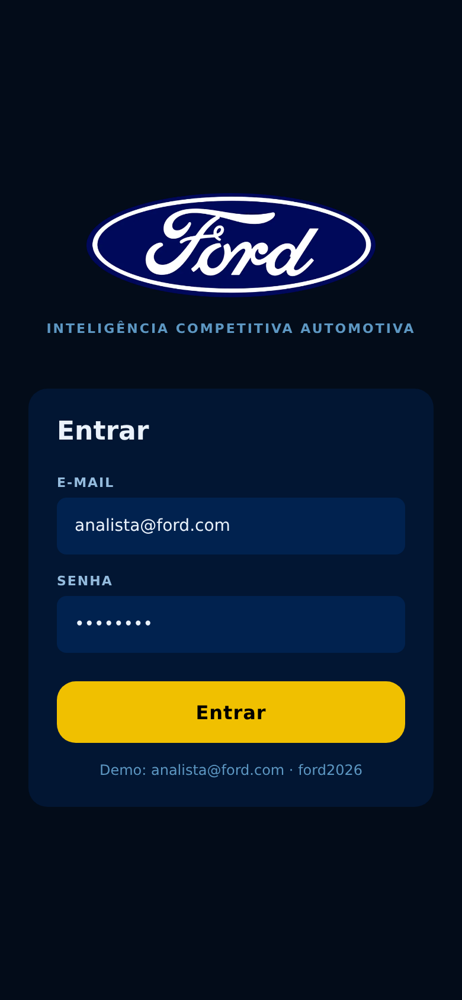
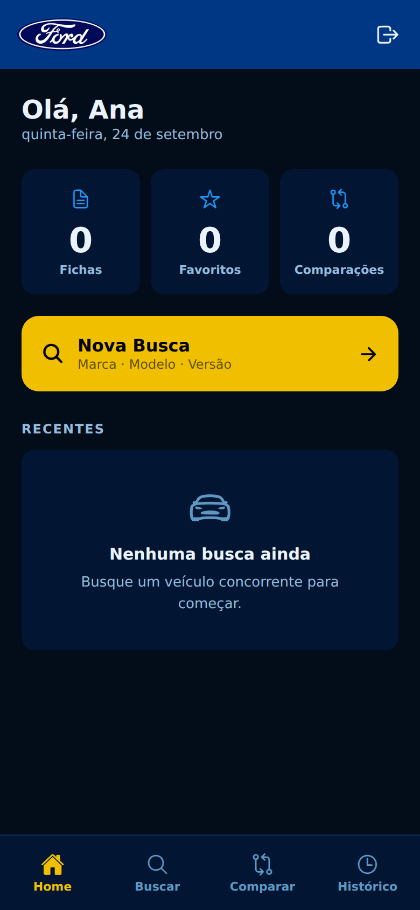
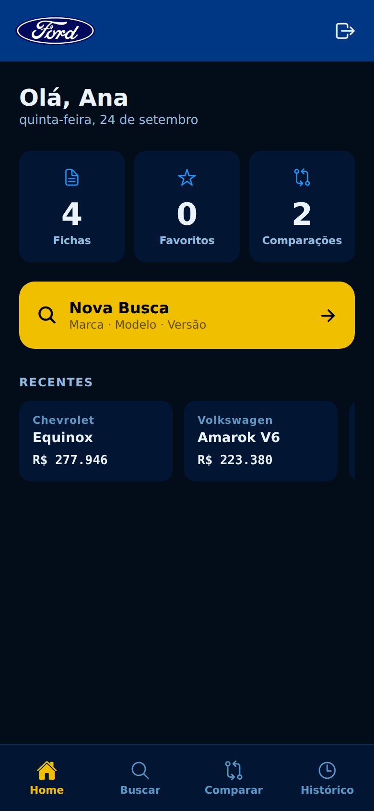
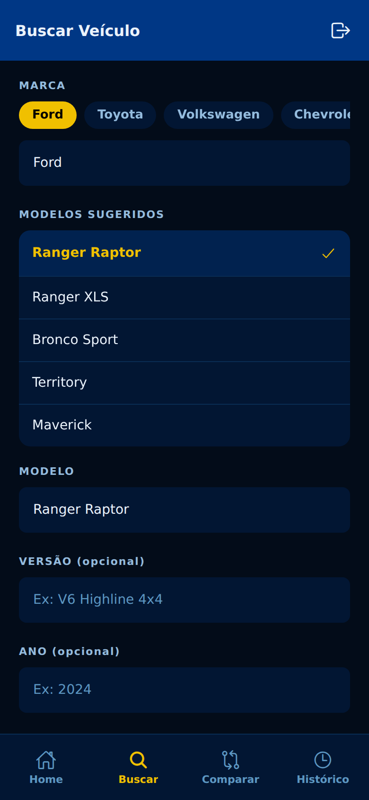
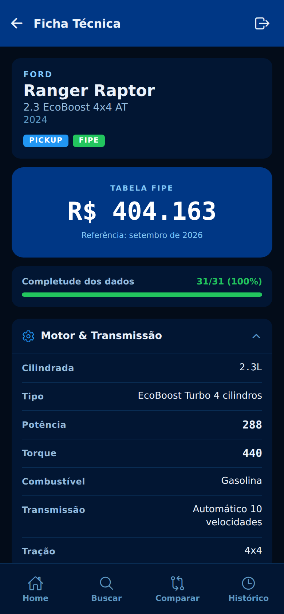
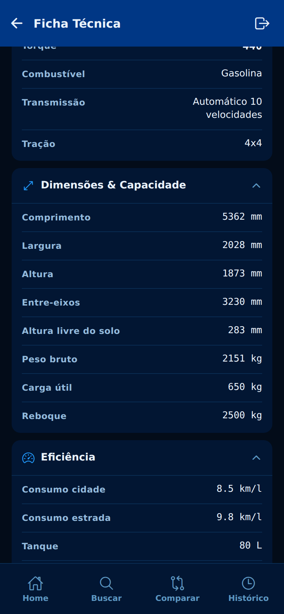
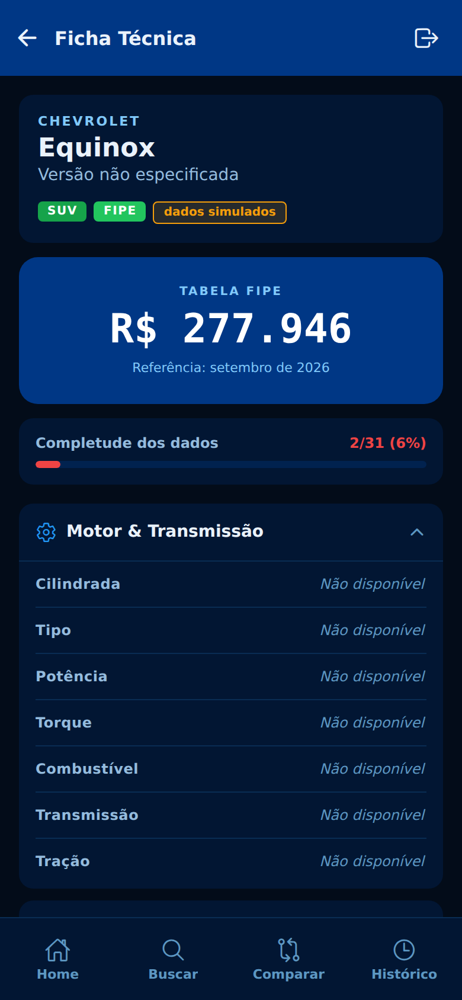
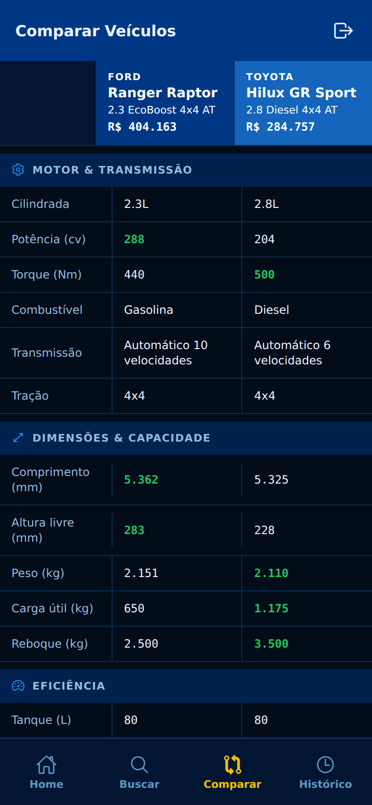
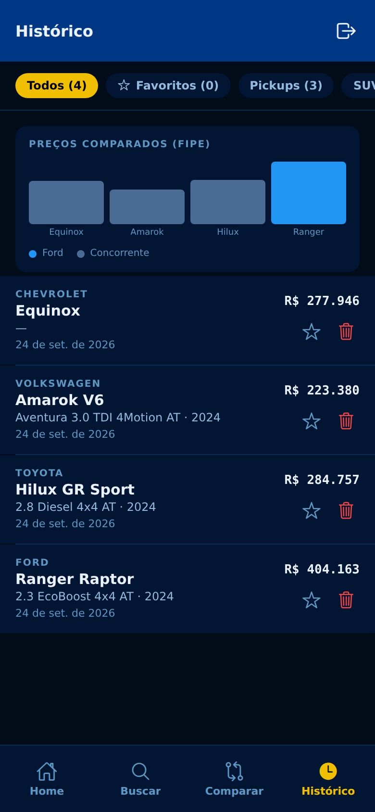

# Ford Intel — Inteligência Competitiva Automotiva

Aplicativo mobile para que analistas da Ford acompanhem as fichas técnicas de veículos concorrentes em um formato **padronizado**, comparem dois modelos lado a lado e monitorem preços da tabela FIPE.

> Projeto da Sprint 3 — Mobile Development and IoT (FIAP).

**APK para Android:** [baixar o Ford Intel](https://expo.dev/artifacts/eas/iaOI1X9fwEeXtjcuLTkjhF-WXEO_QLUWq8_Awt82lkE.apk)

## Sobre o desafio

Analistas de produto precisam saber, com rapidez e confiança, como os concorrentes se posicionam em motor, dimensões, eficiência, segurança, tecnologia e preço. Hoje essas informações ficam espalhadas em fontes diferentes e em formatos diferentes.

O Ford Intel resolve isso com uma **ficha técnica padronizada**: todo veículo tem sempre os mesmos campos, e o que não é conhecido aparece explicitamente como "Não disponível", em vez de sumir ou quebrar a tela. Isso permite comparar veículos de marcas diferentes na mesma base.

## Demonstração das telas

<table>
  <tr>
    <td align="center"><br><b>Login</b><br>Logo da Ford e acesso do analista</td>
    <td align="center"><br><b>Home (primeiro acesso)</b><br>Indicadores, atalho de busca e estado vazio</td>
    <td align="center"><br><b>Home</b><br>Buscas recentes com preço FIPE e botão de sair</td>
  </tr>
  <tr>
    <td align="center"><br><b>Busca</b><br>Marca, modelos sugeridos, versão e ano</td>
    <td align="center"><br><b>Ficha técnica</b><br>Preço FIPE, completude e seções</td>
    <td align="center"><br><b>Detalhes da ficha</b><br>Dimensões e eficiência em fonte tabular</td>
  </tr>
  <tr>
    <td align="center"><br><b>Ficha com dados parciais</b><br>Campos ausentes explícitos e barra de completude</td>
    <td align="center"><br><b>Comparação</b><br>Dois veículos lado a lado, vencedor em verde</td>
    <td align="center"><br><b>Histórico</b><br>Filtros, gráfico de preços, favoritos e exclusão</td>
  </tr>
</table>

## Funcionalidades

- **Login** com sessão persistida no dispositivo e **botão de sair** no cabeçalho, com confirmação.
- **Busca de veículos** por marca, modelo, versão e ano, com chips de marca e modelos sugeridos.
- **Ficha técnica padronizada** com motor, dimensões, eficiência, segurança, tecnologia e preço FIPE, em seções recolhíveis.
- **Preço em tempo real** pela API pública da tabela FIPE, respeitando versão e ano do veículo.
- **Barra de completude** que mostra quantos campos da ficha foram preenchidos (verde, amarelo ou vermelho).
- **Comparação lado a lado** de dois veículos, destacando o vencedor de cada métrica numérica.
- **Histórico** com filtros por categoria e favoritos, gráfico de preços comparados (Ford em destaque) e exclusão com confirmação.
- **Alertas de preço** por notificação local para os veículos salvos.

## Identidade visual

- **Paleta:** azuis da marca `#003785`, `#1465BB`, `#2196F3` e `#81C9FA`. Fundos e superfícies derivam do azul principal. O amarelo `#F0C000` é reservado ao botão principal de cada tela, à aba ativa e à seleção. Verde, âmbar e vermelho aparecem só como status.
- **Tipografia:** números importantes (preço, potência, torque, medidas) usam fonte monoespaçada com dígitos de largura fixa, para leitura e alinhamento.
- **Ícones:** biblioteca Ionicons em todo o app, sem emojis.
- **Tokens:** todas as cores, raios e a tipografia numérica ficam em `constants/colors.ts`. Nenhuma tela define cor por conta própria.

## Fonte dos dados

- **12 veículos com ficha completa** (mock): Ford Ranger Raptor e Bronco Sport, Toyota Hilux GR Sport e Corolla Cross, Volkswagen Amarok V6, Mitsubishi L200 Triton, Chevrolet S10 High Country, RAM 1500 Laramie, Honda CR-V, Hyundai Tucson, Jeep Compass e Nissan Frontier.
- **Preço FIPE real** para qualquer veículo das 14 marcas suportadas, consultado na API `parallelum.com.br/fipe/api/v1`.
- **Demais veículos:** a ficha vem com os campos técnicos como "Não disponível", o preço FIPE quando encontrado e o selo "dados simulados".
- A API pública da FIPE tem limite diário de requisições. As listas de modelos ficam em cache durante a sessão para reduzir chamadas.

## Stack

- Expo SDK 57 e Expo Router
- React Native 0.86, React 19 e TypeScript (strict)
- Zustand com AsyncStorage para estado e persistência
- Expo Notifications para os alertas
- Ionicons (`@expo/vector-icons`)
- API FIPE para preços

## Estrutura do projeto

```
app/
  _layout.tsx          Navegação raiz e restauração da sessão
  index.tsx            Redireciona para login ou home
  login.tsx            Tela de login
  (tabs)/
    _layout.tsx        Barra de abas e cabeçalho
    home.tsx           Resumo, indicadores e buscas recentes
    search.tsx         Busca de veículos
    result.tsx         Ficha técnica
    compare.tsx        Comparação lado a lado
    history.tsx        Histórico, filtros e gráfico
components/ui/         Badge, FordLogo, LogoutButton, SpecRow e tipo de ícone
constants/             Tema (colors), veículos sugeridos e dados de exemplo
services/              FIPE, montagem da ficha e notificações
store/                 Estado de autenticação e de fichas (Zustand)
types/                 Tipos da ficha técnica
utils/                 Formatação e diálogo de confirmação
docs/screenshots/      Capturas usadas neste README
assets/images/         Logo, ícone do app, splash e ícone de notificação
```

## Como rodar

Requisitos: Node.js 20.19.4 ou superior (recomendado 22 LTS) e o app **Expo Go** atualizado no celular (o projeto usa o SDK 57).

```bash
npm install
npx expo start
```

Escaneie o QR code com o Expo Go (Android) ou com a câmera (iPhone).

Se o computador e o celular não estiverem na mesma rede, ou se o Metro rodar dentro do WSL2, use o túnel:

```bash
npx expo login
npx expo start --tunnel
```

No túnel é preciso estar logado na mesma conta Expo no terminal e no Expo Go. Na primeira execução pode ser necessário `npm install --no-save @expo/ngrok`.

**Credenciais de demonstração:** `analista@ford.com` / `ford2026`

Para abrir no navegador: `npx expo start --web`.

## Gerar o APK (Android)

O build usa o Expo EAS Build e gera um arquivo `.apk` instalável diretamente. O perfil está em `eas.json` e o identificador do app é `com.fordintel.app`.

```bash
npx eas-cli login
npm run build:apk
```

Na primeira execução o EAS pergunta se pode criar o projeto na sua conta Expo e se deve gerar a chave de assinatura Android. Responda que sim às duas. Ao terminar, o EAS pergunta se deseja instalar o app num emulador: responda que **não**, a menos que o Android Studio esteja instalado. O terminal mostra o link para baixar o APK.

O build roda na nuvem do Expo e pode ter fila no plano gratuito.

### APK da versão final

- **Download:** [Ford Intel 1.0.0 (APK)](https://expo.dev/artifacts/eas/iaOI1X9fwEeXtjcuLTkjhF-WXEO_QLUWq8_Awt82lkE.apk)
- **Detalhes do build:** [painel do EAS](https://expo.dev/accounts/vcastro232/projects/ford-intel/builds/4a98b27e-6cfe-455b-8550-c2f9ccc07556)
- **Pacote:** `com.fordintel.app` · **Versão:** 1.0.0 · **Perfil:** `preview`

### Instalação no Android

1. Abra o link do APK no celular Android e baixe o arquivo.
2. Toque no arquivo baixado. Se o Android pedir, permita a instalação de fontes desconhecidas para o navegador usado.
3. Abra o **Ford Intel** e entre com `analista@ford.com` / `ford2026`.

## Verificações

```bash
npm run typecheck     # TypeScript sem erros
npx expo-doctor       # 21 de 21 verificações do projeto
```

## Equipe

| Nome | RM |
|---|---|
| Guilherme Barbiero | RM555185 |
| Marco Antonio Gonçalves | RM556818 |
| Vinicius Castro | RM556137 |
| Camila Mie Takara | RM555418 |
| Matheus Cantiere | RM558479 |
